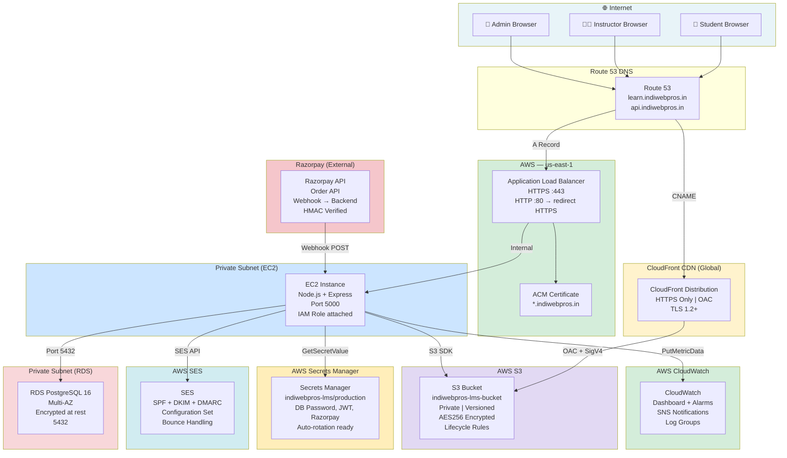

# AWS Architecture — IndiWebPros LMS
# Milestone 24: Production Infrastructure

## Full Architecture Diagram



---

## Service Summary

| Service | Purpose | Configuration |
|---------|---------|--------------|
| **Route 53** | DNS | CNAME → CloudFront, A → ALB |
| **ACM** | SSL/TLS | Wildcard cert `*.indiwebpros.in` |
| **CloudFront** | CDN | OAC, HTTPS-only, cache behaviors |
| **ALB** | Load Balancer | HTTP→HTTPS redirect, port 443 |
| **EC2** | App Server | Node.js, IAM role, private subnet |
| **RDS** | Database | PostgreSQL 16, Multi-AZ, encrypted |
| **S3** | File Storage | Private, versioned, AES256, lifecycle |
| **SES** | Email | SPF/DKIM/DMARC, configuration set |
| **Secrets Manager** | Secrets | All credentials, auto-rotation ready |
| **CloudWatch** | Monitoring | Dashboard, alarms, SNS notifications |
| **Razorpay** | Payments | Webhook HMAC verified, no SDK |

---

## Deployment Flow

```
Developer Push → GitHub
    → GitHub Actions (CI)
        → pnpm build (TypeScript compile)
        → Run tests
        → Deploy to EC2 via SSM
            → pm2 reload app
            → Health check
```

---

## Data Flow: Student Course Purchase

```
1. Student clicks "Buy" 
   → POST /api/v1/purchases (ALB → EC2)
   → EC2 fetches course from RDS
   → EC2 calls Razorpay API: create order
   → Returns order_id + key_id to frontend

2. Student completes Razorpay popup
   → Frontend gets razorpay_order_id, razorpay_payment_id, razorpay_signature

3. POST /api/v1/payments/razorpay/verify
   → EC2 verifies HMAC SHA256
   → Updates Payment in RDS
   → Creates Enrollment in RDS
   → SES sends confirmation email
   → CloudWatch metric: EnrollmentsCreated + PaymentSuccesses

4. Razorpay sends webhook: payment.captured
   → POST /api/v1/payments/razorpay/webhook
   → EC2 verifies HMAC on rawBody
   → Idempotently confirms enrollment (already created in step 3)
```
