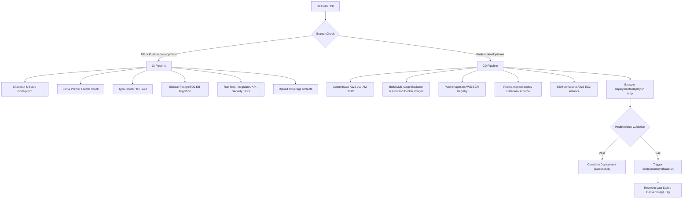

# DevSecOps CI/CD & Production Deployment Architecture
# IndiWebPros LMS — Milestone 27

This document details the CI/CD pipeline design, containerization architecture, security scanning, environments model, rollback, and disaster recovery strategies for the IndiWebPros Learning Management System (LMS).

---

## 1. Monorepo DevOps Folder Structure

The following directories and files constitute the DevOps pipeline and container configuration:

```
├── .github/
│   ├── workflows/
│   │   ├── ci.yml                 # Continuous Integration Pipeline (Lint, Compile, Tests)
│   │   ├── cd.yml                 # Continuous Delivery Pipeline (AWS OIDC, Deployments)
│   │   ├── release.yml            # Automated Semantic Release Tagging
│   │   ├── security.yml           # CodeQL, secrets scanning, license check audits
│   │   └── dependency-update.yml  # Weekly outdated packages checking
│   └── dependabot.yml             # Dependabot schedule configuration
├── docker/
│   ├── Dockerfile.backend         # Optimized multi-stage backend runner
│   ├── Dockerfile.frontend        # Multi-stage frontend compilation with Nginx runner
│   └── nginx.conf                 # Secure Nginx server configuration (CSP, HSTS)
├── deployments/
│   ├── deploy.sh                  # Main EC2 pull, migration and swap script
│   ├── healthcheck.sh             # curl-based live/ready validation engine
│   └── rollback.sh                # Automated failure container reverter
├── docker-compose.dev.yml         # Local database + redis development stack
└── docker-compose.prod.yml        # Production Docker Compose definition mapping ECR
```

---

## 2. Git Branching & Environment Strategy

Our deployment strategy aligns with GitFlow principles for environment isolation:

```
                    ┌──────────────┐
                    │  feature/*   │ (Local development / Sandbox)
                    └──────┬───────┘
                           │ Pull Request
                           ▼
                    ┌──────────────┐
                    │   develop    │ (Staging Environment)
                    └──────┬───────┘
                           │ Pull Request (Approved & Reviewed)
                           ▼
                    ┌──────────────┐
                    │     main     │ (Production Environment)
                    └──────────────┘
```

### Environment Settings Mapping
| Parameter | Staging | Production |
|---|---|---|
| **Branch** | `develop` | `main` |
| **AWS Target** | Staging EC2 Instance | Production Auto-Scaled EC2 Instance |
| **Prisma Migrations** | Automatic (`migrate deploy`) | Automatic (`migrate deploy` via CD) |
| **Image Tag** | `git-sha` / `staging-latest` | `git-sha` / `latest` / `v*` |
| **Verification Probe** | Staging `/health/ready` | Production `/health/ready` |

---

## 3. GitHub Actions Pipelines

### CI/CD Workflow Pipeline Diagram



---

## 4. Containerization Architecture

### Backend: Dockerfile.backend (Multi-stage Slim Node)
- **Stage 1 (Builder)**: Uses `node:22-alpine` to install full dependencies (including development) and compile TS to Javascript inside the `/backend/dist` folder.
- **Stage 2 (Runner)**: Uses `node:22-alpine` starting from a clean slate. Copies the pre-built `dist/` directory and installs *only* production dependencies (`pnpm install --prod`).
- **Security**: The process runs under the non-privileged `node` user instead of root.

### Frontend: Dockerfile.frontend (Multi-stage Nginx)
- **Stage 1 (Builder)**: Compiles static assets using Vite React builder (`pnpm build`), generating production assets inside the `dist/` directory.
- **Stage 2 (Runner)**: Copies static assets into a lightweight `nginx:1.25-alpine` runtime.
- **Nginx Hardening**:
  - Configures **Gzip** compression for static pages, JS, CSS, and fonts.
  - Implements Single Page Application fallback routing (`try_files $uri $uri/ /index.html`).
  - Sets up secure HTTP headers:
    - `Strict-Transport-Security (HSTS)`
    - `Content-Security-Policy (CSP)`
    - `X-Frame-Options (DENY)`
    - `X-Content-Type-Options (nosniff)`

---

## 5. Security & DevSecOps Gateways

The security scans are managed by `.github/workflows/security.yml` which executes:
1. **Static Analysis (SAST)**: Using GitHub CodeQL to analyze TypeScript syntax for security code patterns (XSS, Prototype pollution, injection).
2. **Dependency Audit**: `pnpm audit` verifies that no packages with known CVEs are included in production.
3. **Secret Detection**: Runs **TruffleHog OSS** scanner to detect accidentally committed cloud keys, passwords, or certificate secrets.
4. **License Compliance**: Runs `license-checker` to prevent legal copyleft licensing issues (e.g. GPL / AGPL).

---

## 6. AWS OIDC Federation

To adhere to least privilege security practices, GitHub Actions integrates with AWS IAM using **OpenID Connect (OIDC)**. This replaces long-lived AWS Access Keys:
1. GitHub establishes an OIDC connection with AWS.
2. The GHA runner requests a temporary, short-lived STS credential from AWS STS assuming a pre-configured IAM Role.
3. The temporary credentials expire automatically after the CD run finishes.

---

## 7. Automatic Rollback Engine

The deploy orchestrator maintains deployment states in `.rollback_tag`. If `healthcheck.sh` reports any unresponsive check (exit code `1`):
1. **Environment Recovery**: Restores `.env.bak` to `.env`.
2. **Container Reversion**: Reads the last stable tag from `.rollback_tag` and restarts containers:
   ```bash
   IMAGE_TAG=$CURRENT_TAG docker compose -f docker-compose.prod.yml up -d --remove-orphans
   ```
3. **Validation**: Verifies health. If successful, recovery is complete. If unsuccessful, it exits with a critical warning for manual SRE intervention.

---

## 8. Disaster Recovery & Database Restoration

In a disaster scenario where RDS database or application data becomes corrupted:

### Database Restore Flow
1. Identify the latest automated RDS daily snapshot via the AWS Console or AWS CLI:
   ```bash
   aws rds describe-db-snapshots --db-instance-identifier indiwebpros-lms-db --query "DBSnapshots[-1].DBSnapshotIdentifier"
   ```
2. Restore the database from the snapshot to a temporary RDS instance:
   ```bash
   aws rds restore-db-instance-from-db-snapshot --db-instance-identifier indiwebpros-lms-db-restored --db-snapshot-identifier <SNAPSHOT_ID>
   ```
3. Update the DNS CNAME mapping or modify the `DATABASE_URL` secret in GitHub Secrets to point to the restored RDS instance hostname.
4. Redeploy via GitHub Actions (`cd.yml`).

### Application Recovery Flow
1. If the EC2 host is completely lost, spin up a new EC2 instance from a pre-configured AMI.
2. Retrieve the docker configuration and keys via SSH.
3. Run the CI/CD deployment pipeline manually (`workflow_dispatch`) to provision docker assets onto the clean target.
