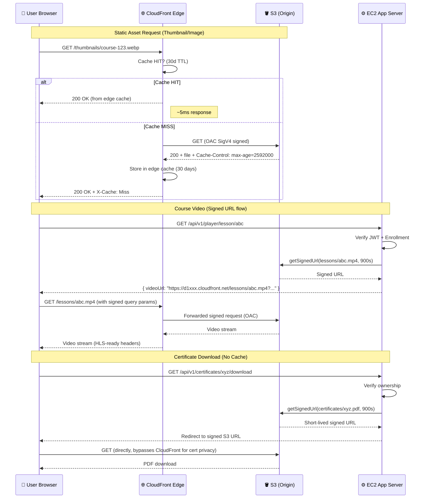

# CloudFront Architecture
# IndiWebPros LMS — Milestone 24

## CDN Flow Diagram



---

## Cache Behavior Matrix

| Path Pattern | TTL | Compress | Notes |
|-------------|-----|----------|-------|
| `/assets/*` | 24h (86400s) | ✅ Gzip+Brotli | JS, CSS, fonts |
| `/images/*` | 7d (604800s) | ✅ Gzip | JPEG, WebP, PNG |
| `/thumbnails/*` | 30d (2592000s) | ✅ Gzip | Course cover images |
| `/avatars/*` | 7d (604800s) | ✅ Gzip | User profile images |
| `/lessons/*` | 24h (86400s) | ❌ (video already compressed) | MP4, HLS segments |
| `/certificates/*` | No cache (0s) | ❌ | PDF — signed access only |
| Default | 24h (86400s) | ✅ | All other static |

---

## HLS Video Streaming (Future Ready)

CloudFront is pre-configured for HLS (HTTP Live Streaming):

```
lessons/
  course-xyz/
    lesson-abc/
      index.m3u8          ← HLS manifest
      segment-000.ts      ← 10s video chunks
      segment-001.ts
      ...
```

**Required headers for HLS** (configured in cache behavior):
- `Access-Control-Allow-Origin: *`
- `Access-Control-Allow-Methods: GET, HEAD, OPTIONS`
- Range request support: `AllowedMethods: GET, HEAD, OPTIONS`

**Future HLS setup:**
1. Process videos with MediaConvert → output to `lessons/` prefix
2. CloudFront serves `.m3u8` + `.ts` chunks with 24h TTL
3. HLS.js or Video.js on frontend handles adaptive bitrate

---

## Origin Access Control (OAC)

OAC replaces the deprecated Origin Access Identity (OAI):

| Feature | OAI (Old) | OAC (New) |
|---------|-----------|-----------|
| Signing | Always | Configurable |
| S3 SSE-KMS | ❌ Not supported | ✅ Supported |
| Bucket policy | ACL-based | Policy-based |
| Security | Lower | Higher |

**OAC configuration:**
```json
{
  "SigningProtocol": "sigv4",
  "SigningBehavior": "always",
  "OriginAccessControlOriginType": "s3"
}
```

---

## Custom Domain Setup (learn.indiwebpros.in)

When domain is ready:

```bash
# 1. Request ACM certificate (must be in us-east-1 for CloudFront)
aws acm request-certificate \
  --domain-name "*.indiwebpros.in" \
  --validation-method DNS \
  --region us-east-1

# 2. Add DNS validation CNAME records in Route 53

# 3. Update CloudFront distribution with custom domain
aws cloudfront update-distribution \
  --id YOUR_DISTRIBUTION_ID \
  --distribution-config '{
    "Aliases": {"Quantity": 1, "Items": ["learn.indiwebpros.in"]},
    "ViewerCertificate": {
      "ACMCertificateArn": "arn:aws:acm:us-east-1:...",
      "SSLSupportMethod": "sni-only",
      "MinimumProtocolVersion": "TLSv1.2_2021"
    }
  }'

# 4. Add Route 53 CNAME
# learn.indiwebpros.in → d1xxx.cloudfront.net
```
