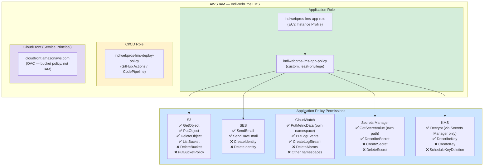

# IAM Roles & Policies Diagram
# IndiWebPros LMS — Milestone 24

## Role Hierarchy



---

## Policy Resource Scoping

| Service | Resource Scope | Wildcard? |
|---------|---------------|-----------|
| S3 Objects | `arn:aws:s3:::indiwebpros-lms-bucket/*` | Objects only |
| S3 Bucket | `arn:aws:s3:::indiwebpros-lms-bucket` | Specific bucket |
| SES | `arn:aws:ses:us-east-1:ACCOUNT:identity/*` | Any identity in account |
| CloudWatch | Namespace condition: `IndiWebPros/LMS` | Namespace-scoped |
| CloudWatch Logs | `arn:aws:logs:...:log-group:/indiwebpros-lms/*` | Path-scoped |
| Secrets Manager | `arn:aws:secretsmanager:...:secret:indiwebpros-lms/*` | Path-scoped |
| KMS | Specific key ARN | Single key |

---

## Principal Mapping

| Principal | Type | Permissions | Used By |
|-----------|------|-------------|---------|
| `indiwebpros-lms-app-role` | IAM Role | `app-role-policy.json` | EC2 Node.js app |
| `indiwebpros-lms-deploy-policy` | IAM Policy | `deployment-policy.json` | GitHub Actions |
| `cloudfront.amazonaws.com` | Service Principal | S3 bucket policy (OAC) | CloudFront distribution |
| `ec2.amazonaws.com` | Trust Principal | `trust-policy.json` | EC2 assume role |

---

## Security Rules Applied

1. ❌ **No AdministratorAccess** for any application role
2. ❌ **No wildcard `Action: "*"`** in any application policy
3. ✅ **Resource-scoped** — all policies specify exact ARNs
4. ✅ **Condition keys** — CloudWatch uses namespace condition
5. ✅ **Deny-by-default** — deployment policy explicitly denies destructive actions
6. ✅ **Instance Profile** — no static access keys on EC2 in production

---

## AWS CLI — Verify Effective Permissions

```bash
# Simulate what the app role can do (replace ACCOUNT_ID)
aws iam simulate-principal-policy \
  --policy-source-arn arn:aws:iam::ACCOUNT_ID:role/indiwebpros-lms-app-role \
  --action-names s3:PutObject s3:DeleteBucket ses:SendEmail iam:CreateUser \
  --resource-arns arn:aws:s3:::indiwebpros-lms-bucket/test.pdf \
  --query 'EvaluationResults[*].[EvalActionName,EvalDecision]' \
  --output table
```

**Expected output:**
```
s3:PutObject   → allowed
s3:DeleteBucket → implicitDeny
ses:SendEmail   → allowed
iam:CreateUser  → implicitDeny
```
