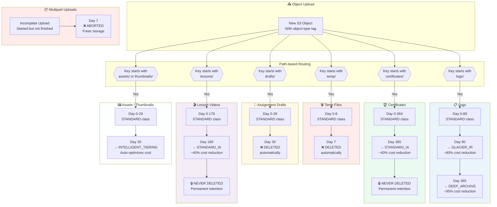

# S3 Lifecycle Diagram
# IndiWebPros LMS — Milestone 24

## Lifecycle Rules Flow



---

## S3 Object Prefix Convention

All uploads **must** use these prefixes for lifecycle rules to apply:

| Prefix | Content Type | Lifecycle Rule |
|--------|-------------|---------------|
| `temp/` | Temporary processing files | Delete after 7 days |
| `drafts/` | Assignment drafts, WIP | Delete after 30 days |
| `logs/` | Application/audit logs | Glacier after 90 days → Deep Archive after 365 |
| `certificates/` | Student certificates (PDF) | Keep forever, IA after 1 year |
| `lessons/` | Lesson videos, media | Keep forever, IA after 180 days |
| `thumbnails/` | Course cover images | Intelligent Tiering after 30 days |
| `avatars/` | User profile pictures | Intelligent Tiering after 30 days |
| `assets/` | Static assets (fonts, icons) | Intelligent Tiering after 30 days |

---

## Storage Class Cost Comparison

| Class | Cost/GB/month | Access Cost | Best For |
|-------|--------------|-------------|---------|
| STANDARD | $0.023 | Free | Frequently accessed |
| STANDARD_IA | $0.0125 | $0.01/GB retrieved | Monthly access |
| INTELLIGENT_TIERING | $0.023→auto | Free monitoring | Unknown patterns |
| GLACIER_IR | $0.004 | $0.03/GB retrieved | Quarterly access |
| DEEP_ARCHIVE | $0.00099 | $0.02/GB retrieved | Annual or never |

---

## Versioning Benefits

With versioning enabled:
- Accidental deletes are recoverable (delete marker instead of permanent delete)
- Previous versions kept for rollback
- Object history maintained for compliance

```bash
# Restore accidentally deleted file
aws s3api delete-object \
  --bucket indiwebpros-lms-bucket \
  --key certificates/CERT_ID.pdf \
  --version-id DELETE_MARKER_ID  # removes the delete marker = restores file
```
