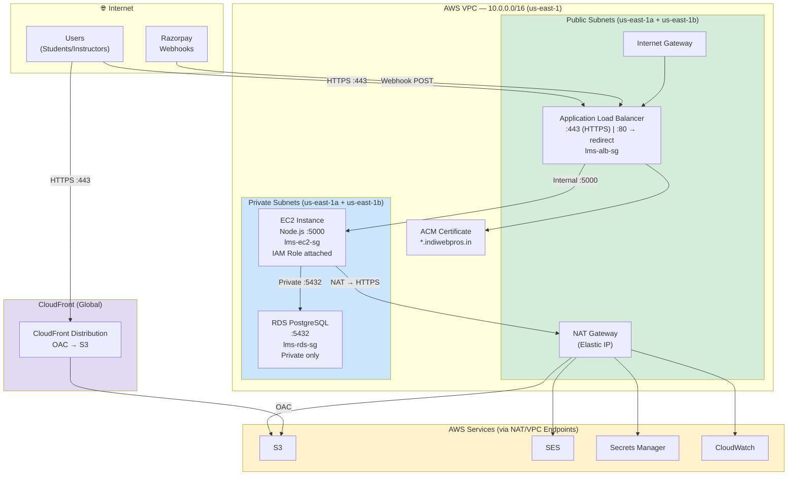

# VPC Architecture — IndiWebPros LMS
# Milestone 24: Network Design

## Network Diagram



---

## Subnet Layout

| Subnet | CIDR | AZ | Purpose |
|--------|------|----|---------|
| `lms-public-1a` | `10.0.1.0/24` | us-east-1a | ALB, NAT Gateway |
| `lms-public-1b` | `10.0.2.0/24` | us-east-1b | ALB (HA) |
| `lms-private-1a` | `10.0.10.0/24` | us-east-1a | EC2 instances, RDS |
| `lms-private-1b` | `10.0.11.0/24` | us-east-1b | RDS standby (Multi-AZ) |

---

## Security Group Rules Summary

| From | To | Port | Rule |
|------|----|------|------|
| Internet | ALB | 443 | HTTPS (public) |
| Internet | ALB | 80 | HTTP → 301 redirect |
| ALB | EC2 | 5000 | App traffic only |
| Trusted IP | EC2 | 22 | SSH admin access |
| EC2 | RDS | 5432 | Database connection |
| RDS | All | — | No outbound (stateless deny) |

---

## AWS CLI — Network Setup

```bash
# Create VPC
VPC_ID=$(aws ec2 create-vpc \
  --cidr-block 10.0.0.0/16 \
  --tag-specifications 'ResourceType=vpc,Tags=[{Key=Name,Value=indiwebpros-lms-vpc},{Key=Application,Value=IndiWebPros-LMS}]' \
  --query Vpc.VpcId --output text)

# Enable DNS hostnames (required for RDS)
aws ec2 modify-vpc-attribute --vpc-id $VPC_ID --enable-dns-hostnames

# Create Internet Gateway
IGW_ID=$(aws ec2 create-internet-gateway \
  --query InternetGateway.InternetGatewayId --output text)
aws ec2 attach-internet-gateway --internet-gateway-id $IGW_ID --vpc-id $VPC_ID

# Create public subnets
PUB_1A=$(aws ec2 create-subnet --vpc-id $VPC_ID --cidr-block 10.0.1.0/24 \
  --availability-zone us-east-1a --query Subnet.SubnetId --output text)
PUB_1B=$(aws ec2 create-subnet --vpc-id $VPC_ID --cidr-block 10.0.2.0/24 \
  --availability-zone us-east-1b --query Subnet.SubnetId --output text)

# Create private subnets
PRIV_1A=$(aws ec2 create-subnet --vpc-id $VPC_ID --cidr-block 10.0.10.0/24 \
  --availability-zone us-east-1a --query Subnet.SubnetId --output text)
PRIV_1B=$(aws ec2 create-subnet --vpc-id $VPC_ID --cidr-block 10.0.11.0/24 \
  --availability-zone us-east-1b --query Subnet.SubnetId --output text)

# Create NAT Gateway (requires Elastic IP)
EIP=$(aws ec2 allocate-address --domain vpc --query AllocationId --output text)
NAT_ID=$(aws ec2 create-nat-gateway \
  --subnet-id $PUB_1A --allocation-id $EIP \
  --query NatGateway.NatGatewayId --output text)

echo "VPC: $VPC_ID | NAT: $NAT_ID"
echo "Public: $PUB_1A, $PUB_1B"
echo "Private: $PRIV_1A, $PRIV_1B"
```

---

## VPC Endpoints (Cost Optimization)

Instead of routing S3/CloudWatch traffic through NAT Gateway, use VPC Endpoints:

```bash
# S3 Gateway Endpoint (FREE — no data transfer charges)
aws ec2 create-vpc-endpoint \
  --vpc-id $VPC_ID \
  --service-name com.amazonaws.us-east-1.s3 \
  --vpc-endpoint-type Gateway \
  --route-table-ids $PRIVATE_ROUTE_TABLE_ID

# Secrets Manager Interface Endpoint ($0.01/hr)
aws ec2 create-vpc-endpoint \
  --vpc-id $VPC_ID \
  --service-name com.amazonaws.us-east-1.secretsmanager \
  --vpc-endpoint-type Interface \
  --subnet-ids $PRIV_1A $PRIV_1B
```

> **Cost saving**: S3 VPC Gateway Endpoint eliminates NAT Gateway data charges for S3 traffic (~$0.045/GB).
